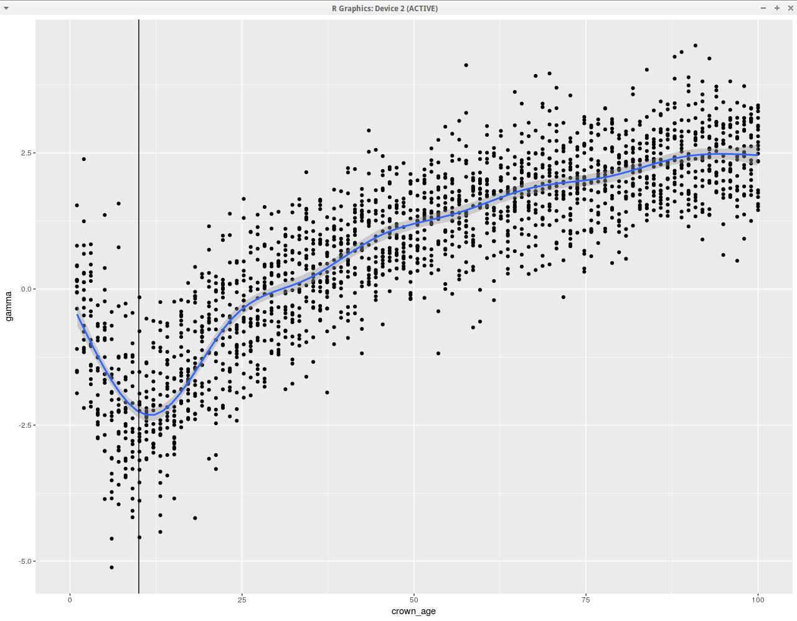

# rabosky_and_hurlbert_2015

My code to do the same as [1],

# References
  
 * [1] Rabosky, Daniel L., and Allen H. Hurlbert. "Species richness at continental scales is dominated by ecological limits." The American Naturalist 185.5 (2015): 572-583.
